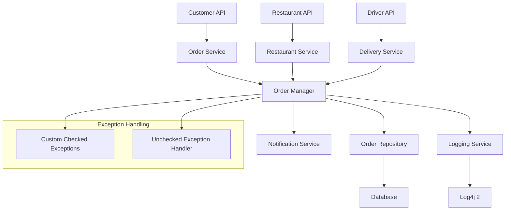

# Design Document

## Overview

The food delivery platform backend is designed as a Java-based system using object-oriented principles with comprehensive exception handling and logging. The system follows a layered architecture with clear separation of concerns, utilizing Log4j 2 for structured logging and custom exception hierarchies for robust error handling. The design emphasizes maintainability, observability, and reliable order state management through enum-based state machines.

## Architecture

### System Architecture



### Layer Responsibilities

- **API Layer**: REST endpoints for customer, restaurant, and driver interactions
- **Service Layer**: Business logic implementation with exception handling
- **Manager Layer**: Order lifecycle coordination and state management
- **Repository Layer**: Data persistence and retrieval
- **Cross-cutting Concerns**: Logging, exception handling, and notifications

## Components and Interfaces

### Core Components

#### 1. Order Management

```java
// Order entity with enum-based state management
public class Order {
    private String orderId;
    private String customerId;
    private String restaurantId;
    private OrderStatus status;
    private LocalDateTime createdAt;
    private LocalDateTime updatedAt;
    private List<OrderItem> items;
    private BigDecimal totalAmount;
    private String deliveryAddress;
    private String driverId;
}

// Order status enum with state transition validation
public enum OrderStatus {
    PENDING,
    ACCEPTED,
    PREPARING,
    READY_FOR_DELIVERY,
    IN_DELIVERY,
    DELIVERED,
    CANCELLED,
    REJECTED;
    
    public boolean canTransitionTo(OrderStatus newStatus) {
        // State transition validation logic
    }
}
```

#### 2. Restaurant Service Interface

```java
public interface RestaurantService {
    void acceptOrder(String orderId, String restaurantId) throws RestaurantUnavailableException, InvalidOrderStateException;
    void rejectOrder(String orderId, String restaurantId, String reason) throws InvalidOrderStateException;
    void markOrderReady(String orderId, String restaurantId) throws InvalidOrderStateException;
}
```

#### 3. Exception Hierarchy

```java
// Base checked exception for business logic errors
public abstract class DeliveryPlatformException extends Exception {
    private final String errorCode;
    private final LocalDateTime timestamp;
    
    protected DeliveryPlatformException(String message, String errorCode) {
        super(message);
        this.errorCode = errorCode;
        this.timestamp = LocalDateTime.now();
    }
}

// Specific business exceptions
public class RestaurantUnavailableException extends DeliveryPlatformException {
    public RestaurantUnavailableException(String restaurantId) {
        super("Restaurant " + restaurantId + " is currently unavailable", "RESTAURANT_UNAVAILABLE");
    }
}

public class InvalidOrderStateException extends DeliveryPlatformException {
    public InvalidOrderStateException(String orderId, OrderStatus currentStatus, OrderStatus attemptedStatus) {
        super(String.format("Cannot transition order %s from %s to %s", orderId, currentStatus, attemptedStatus), 
              "INVALID_STATE_TRANSITION");
    }
}

public class DeliveryAssignmentException extends DeliveryPlatformException {
    public DeliveryAssignmentException(String orderId, String reason) {
        super("Failed to assign delivery for order " + orderId + ": " + reason, "DELIVERY_ASSIGNMENT_FAILED");
    }
}
```

### 4. Logging Service

```java
public class OrderLoggingService {
    private static final Logger logger = LogManager.getLogger(OrderLoggingService.class);
    
    public void logOrderCreated(Order order) {
        logger.info("Order created: orderId={}, customerId={}, restaurantId={}, amount={}", 
                   order.getOrderId(), order.getCustomerId(), order.getRestaurantId(), order.getTotalAmount());
    }
    
    public void logOrderStatusChange(String orderId, OrderStatus oldStatus, OrderStatus newStatus, String reason) {
        logger.info("Order status changed: orderId={}, from={}, to={}, reason={}", 
                   orderId, oldStatus, newStatus, reason);
    }
    
    public void logBusinessException(DeliveryPlatformException ex, String orderId) {
        logger.warn("Business exception occurred: orderId={}, errorCode={}, message={}", 
                   orderId, ex.getErrorCode(), ex.getMessage());
    }
    
    public void logSystemError(Exception ex, String context) {
        logger.error("System error occurred: context={}, error={}", context, ex.getMessage(), ex);
    }
}
```

## Data Models

### Order Entity Structure

```java
public class Order {
    @Id
    private String orderId;
    
    @NotNull
    private String customerId;
    
    @NotNull
    private String restaurantId;
    
    @Enumerated(EnumType.STRING)
    private OrderStatus status;
    
    @CreationTimestamp
    private LocalDateTime createdAt;
    
    @UpdateTimestamp
    private LocalDateTime updatedAt;
    
    @OneToMany(cascade = CascadeType.ALL, fetch = FetchType.LAZY)
    private List<OrderItem> items;
    
    @DecimalMin("0.01")
    private BigDecimal totalAmount;
    
    @NotBlank
    private String deliveryAddress;
    
    private String driverId;
    
    private String cancellationReason;
    
    // State transition methods with validation
    public void transitionTo(OrderStatus newStatus, String reason) throws InvalidOrderStateException {
        if (!this.status.canTransitionTo(newStatus)) {
            throw new InvalidOrderStateException(this.orderId, this.status, newStatus);
        }
        
        OrderStatus oldStatus = this.status;
        this.status = newStatus;
        this.updatedAt = LocalDateTime.now();
        
        // Log the transition
        LogManager.getLogger(Order.class).info(
            "Order status transition: orderId={}, from={}, to={}, reason={}", 
            orderId, oldStatus, newStatus, reason
        );
    }
}
```

### Restaurant Entity

```java
public class Restaurant {
    private String restaurantId;
    private String name;
    private boolean isOpen;
    private LocalTime openTime;
    private LocalTime closeTime;
    private int maxConcurrentOrders;
    private int currentOrderCount;
    
    public boolean canAcceptOrder() {
        return isOpen && currentOrderCount < maxConcurrentOrders;
    }
}
```

## Error Handling

### Exception Handling Strategy

#### Checked Exceptions (Business Logic Errors)
- **RestaurantUnavailableException**: When restaurant is closed or at capacity
- **InvalidOrderStateException**: When attempting invalid state transitions
- **DeliveryAssignmentException**: When delivery assignment fails
- **OrderValidationException**: When order data is invalid

#### Unchecked Exception Handling
- **Global Exception Handler**: Catches all unchecked exceptions
- **Logging**: All unchecked exceptions logged at ERROR level with full context
- **Graceful Degradation**: System continues operation where possible
- **Circuit Breaker**: Prevents cascade failures in external service calls

### Exception Processing Flow

```java
@Component
public class GlobalExceptionHandler {
    private static final Logger logger = LogManager.getLogger(GlobalExceptionHandler.class);
    private final OrderLoggingService loggingService;
    
    @ExceptionHandler(DeliveryPlatformException.class)
    public ResponseEntity<ErrorResponse> handleBusinessException(DeliveryPlatformException ex) {
        loggingService.logBusinessException(ex, extractOrderId(ex));
        return ResponseEntity.badRequest().body(new ErrorResponse(ex.getErrorCode(), ex.getMessage()));
    }
    
    @ExceptionHandler(RuntimeException.class)
    public ResponseEntity<ErrorResponse> handleSystemException(RuntimeException ex) {
        loggingService.logSystemError(ex, "Unexpected system error");
        return ResponseEntity.status(HttpStatus.INTERNAL_SERVER_ERROR)
                           .body(new ErrorResponse("SYSTEM_ERROR", "An unexpected error occurred"));
    }
}
```

## Testing Strategy

### Unit Testing Approach
- **Service Layer Testing**: Mock dependencies, test business logic and exception scenarios
- **Exception Testing**: Verify correct exception types and messages for various failure scenarios
- **State Transition Testing**: Test all valid and invalid order status transitions
- **Logging Verification**: Verify correct log levels and messages for different scenarios

### Integration Testing
- **End-to-End Order Flow**: Test complete order lifecycle from creation to delivery
- **Exception Propagation**: Verify exceptions are properly caught and logged
- **Database Transactions**: Test rollback scenarios and data consistency
- **Logging Integration**: Verify Log4j 2 configuration and log output

### Test Data Management
- **Order Test Fixtures**: Predefined orders in various states for testing
- **Exception Scenarios**: Test cases for each custom exception type
- **Mock Services**: Restaurant and driver service mocks for isolated testing

## Log4j 2 Configuration

### Logging Levels Usage
- **INFO**: Normal operations (order creation, status changes, successful operations)
- **WARN**: Business exceptions, potential issues, performance warnings
- **ERROR**: System errors, unchecked exceptions, critical failures

### Log Configuration Structure
```xml
<?xml version="1.0" encoding="UTF-8"?>
<Configuration status="WARN">
    <Appenders>
        <Console name="Console" target="SYSTEM_OUT">
            <PatternLayout pattern="%d{HH:mm:ss.SSS} [%t] %-5level %logger{36} - %msg%n"/>
        </Console>
        <RollingFile name="FileAppender" fileName="logs/delivery-platform.log"
                     filePattern="logs/delivery-platform-%d{yyyy-MM-dd}-%i.log.gz">
            <PatternLayout pattern="%d{yyyy-MM-dd HH:mm:ss.SSS} [%t] %-5level %logger{36} - %msg%n"/>
            <Policies>
                <TimeBasedTriggeringPolicy />
                <SizeBasedTriggeringPolicy size="10MB"/>
            </Policies>
        </RollingFile>
    </Appenders>
    <Loggers>
        <Logger name="com.deliveryplatform" level="INFO" additivity="false">
            <AppenderRef ref="Console"/>
            <AppenderRef ref="FileAppender"/>
        </Logger>
        <Root level="WARN">
            <AppenderRef ref="Console"/>
        </Root>
    </Loggers>
</Configuration>
```

This design provides a robust foundation for the food delivery platform with comprehensive exception handling, structured logging, and clear separation of concerns that will enable effective monitoring and troubleshooting of the system.