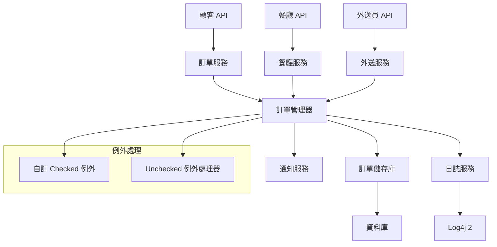

# 設計文件

## 概述

本外送平台後端以 Java 為基礎，採用物件導向設計，並具備完整的例外處理與日誌紀錄。系統遵循分層架構，明確區分各層責任，使用 Log4j 2 進行結構化日誌，並以自訂例外階層強化錯誤處理。設計重點在於可維護性、可觀察性，以及透過 enum 狀態機確保訂單狀態管理的可靠性。

## 架構

### 系統架構



### 各層責任

- **API 層**：提供顧客、餐廳、外送員的 REST 端點
- **服務層**：實作商業邏輯並處理例外
- **管理層**：協調訂單生命週期與狀態管理
- **儲存層**：資料持久化與存取
- **橫切關注**：日誌、例外處理、通知

## 元件與介面

### 核心元件

#### 1. 訂單管理

```java
// 具 enum 狀態管理的訂單實體
public class Order {
    private String orderId;
    private String customerId;
    private String restaurantId;
    private OrderStatus status;
    private LocalDateTime createdAt;
    private LocalDateTime updatedAt;
    private List<OrderItem> items;
    private BigDecimal totalAmount;
    private String deliveryAddress;
    private String driverId;
}

// 具狀態轉換驗證的訂單狀態 enum
public enum OrderStatus {
    PENDING,
    ACCEPTED,
    PREPARING,
    READY_FOR_DELIVERY,
    IN_DELIVERY,
    DELIVERED,
    CANCELLED,
    REJECTED;
    
    public boolean canTransitionTo(OrderStatus newStatus) {
        // 狀態轉換驗證邏輯
    }
}
```

#### 2. 餐廳服務介面

```java
public interface RestaurantService {
    void acceptOrder(String orderId, String restaurantId) throws RestaurantUnavailableException, InvalidOrderStateException;
    void rejectOrder(String orderId, String restaurantId, String reason) throws InvalidOrderStateException;
    void markOrderReady(String orderId, String restaurantId) throws InvalidOrderStateException;
}
```

#### 3. 例外階層

```java
// 商業邏輯錯誤的基礎 checked 例外
public abstract class DeliveryPlatformException extends Exception {
    private final String errorCode;
    private final LocalDateTime timestamp;
    
    protected DeliveryPlatformException(String message, String errorCode) {
        super(message);
        this.errorCode = errorCode;
        this.timestamp = LocalDateTime.now();
    }
}

// 特定商業例外
public class RestaurantUnavailableException extends DeliveryPlatformException {
    public RestaurantUnavailableException(String restaurantId) {
        super("餐廳 " + restaurantId + " 目前無法接單", "RESTAURANT_UNAVAILABLE");
    }
}

public class InvalidOrderStateException extends DeliveryPlatformException {
    public InvalidOrderStateException(String orderId, OrderStatus currentStatus, OrderStatus attemptedStatus) {
        super(String.format("無法將訂單 %s 從 %s 轉換為 %s", orderId, currentStatus, attemptedStatus), 
              "INVALID_STATE_TRANSITION");
    }
}

public class DeliveryAssignmentException extends DeliveryPlatformException {
    public DeliveryAssignmentException(String orderId, String reason) {
        super("訂單 " + orderId + " 指派外送失敗: " + reason, "DELIVERY_ASSIGNMENT_FAILED");
    }
}
```

### 4. 日誌服務

```java
public class OrderLoggingService {
    private static final Logger logger = LogManager.getLogger(OrderLoggingService.class);
    
    public void logOrderCreated(Order order) {
        logger.info("建立訂單: orderId={}, customerId={}, restaurantId={}, amount={}", 
                   order.getOrderId(), order.getCustomerId(), order.getRestaurantId(), order.getTotalAmount());
    }
    
    public void logOrderStatusChange(String orderId, OrderStatus oldStatus, OrderStatus newStatus, String reason) {
        logger.info("訂單狀態變更: orderId={}, from={}, to={}, reason={}", 
                   orderId, oldStatus, newStatus, reason);
    }
    
    public void logBusinessException(DeliveryPlatformException ex, String orderId) {
        logger.warn("商業例外發生: orderId={}, errorCode={}, message={}", 
                   orderId, ex.getErrorCode(), ex.getMessage());
    }
    
    public void logSystemError(Exception ex, String context) {
        logger.error("系統錯誤: context={}, error={}", context, ex.getMessage(), ex);
    }
}
```

## 資料模型

### 訂單實體結構

```java
public class Order {
    @Id
    private String orderId;
    
    @NotNull
    private String customerId;
    
    @NotNull
    private String restaurantId;
    
    @Enumerated(EnumType.STRING)
    private OrderStatus status;
    
    @CreationTimestamp
    private LocalDateTime createdAt;
    
    @UpdateTimestamp
    private LocalDateTime updatedAt;
    
    @OneToMany(cascade = CascadeType.ALL, fetch = FetchType.LAZY)
    private List<OrderItem> items;
    
    @DecimalMin("0.01")
    private BigDecimal totalAmount;
    
    @NotBlank
    private String deliveryAddress;
    
    private String driverId;
    
    private String cancellationReason;
    
    // 狀態轉換方法，含驗證
    public void transitionTo(OrderStatus newStatus, String reason) throws InvalidOrderStateException {
        if (!this.status.canTransitionTo(newStatus)) {
            throw new InvalidOrderStateException(this.orderId, this.status, newStatus);
        }
        
        OrderStatus oldStatus = this.status;
        this.status = newStatus;
        this.updatedAt = LocalDateTime.now();
        
        // 記錄狀態轉換
        LogManager.getLogger(Order.class).info(
            "訂單狀態轉換: orderId={}, from={}, to={}, reason={}", 
            orderId, oldStatus, newStatus, reason
        );
    }
}
```

### 餐廳實體

```java
public class Restaurant {
    private String restaurantId;
    private String name;
    private boolean isOpen;
    private LocalTime openTime;
    private LocalTime closeTime;
    private int maxConcurrentOrders;
    private int currentOrderCount;
    
    public boolean canAcceptOrder() {
        return isOpen && currentOrderCount < maxConcurrentOrders;
    }
}
```

## 錯誤處理

### 例外處理策略

#### Checked 例外（商業邏輯錯誤）
- **RestaurantUnavailableException**：餐廳關閉或已達容量時
- **InvalidOrderStateException**：嘗試無效狀態轉換時
- **DeliveryAssignmentException**：指派外送失敗時
- **OrderValidationException**：訂單資料無效時

#### Unchecked 例外處理
- **全域例外處理器**：攔截所有未檢查例外
- **日誌**：所有未檢查例外以 ERROR 層級記錄，並附完整上下文
- **優雅降級**：系統盡可能持續運作
- **斷路器**：防止外部服務連鎖失敗

### 例外處理流程

```java
@Component
public class GlobalExceptionHandler {
    private static final Logger logger = LogManager.getLogger(GlobalExceptionHandler.class);
    private final OrderLoggingService loggingService;
    
    @ExceptionHandler(DeliveryPlatformException.class)
    public ResponseEntity<ErrorResponse> handleBusinessException(DeliveryPlatformException ex) {
        loggingService.logBusinessException(ex, extractOrderId(ex));
        return ResponseEntity.badRequest().body(new ErrorResponse(ex.getErrorCode(), ex.getMessage()));
    }
    
    @ExceptionHandler(RuntimeException.class)
    public ResponseEntity<ErrorResponse> handleSystemException(RuntimeException ex) {
        loggingService.logSystemError(ex, "非預期系統錯誤");
        return ResponseEntity.status(HttpStatus.INTERNAL_SERVER_ERROR)
                           .body(new ErrorResponse("SYSTEM_ERROR", "發生非預期錯誤"));
    }
}
```

## 測試策略

### 單元測試
- **服務層測試**：mock 依賴，測試商業邏輯與例外情境
- **例外測試**：驗證各種失敗情境下的例外型別與訊息
- **狀態轉換測試**：測試所有合法與非法的訂單狀態轉換
- **日誌驗證**：檢查不同情境下的日誌層級與訊息

### 整合測試
- **端到端訂單流程**：測試訂單從建立到送達的完整流程
- **例外傳遞**：驗證例外正確被攔截與記錄
- **資料庫交易**：測試回滾與資料一致性
- **日誌整合**：驗證 Log4j 2 設定與日誌輸出

### 測試資料管理
- **訂單測試樣本**：預設多種狀態的訂單
- **例外情境**：每種自訂例外的測試案例
- **Mock 服務**：餐廳與外送員服務的 mock 物件

## Log4j 2 設定

### 日誌層級
- **INFO**：正常操作（訂單建立、狀態變更、成功操作）
- **WARN**：商業例外、潛在問題、效能警告
- **ERROR**：系統錯誤、未檢查例外、重大失敗

### 設定範例
```xml
<?xml version="1.0" encoding="UTF-8"?>
<Configuration status="WARN">
    <Appenders>
        <Console name="Console" target="SYSTEM_OUT">
            <PatternLayout pattern="%d{HH:mm:ss.SSS} [%t] %-5level %logger{36} - %msg%n"/>
        </Console>
        <RollingFile name="FileAppender" fileName="logs/delivery-platform.log"
                     filePattern="logs/delivery-platform-%d{yyyy-MM-dd}-%i.log.gz">
            <PatternLayout pattern="%d{yyyy-MM-dd HH:mm:ss.SSS} [%t] %-5level %logger{36} - %msg%n"/>
            <Policies>
                <TimeBasedTriggeringPolicy />
                <SizeBasedTriggeringPolicy size="10MB"/>
            </Policies>
        </RollingFile>
    </Appenders>
    <Loggers>
        <Logger name="com.deliveryplatform" level="INFO" additivity="false">
            <AppenderRef ref="Console"/>
            <AppenderRef ref="FileAppender"/>
        </Logger>
        <Root level="WARN">
            <AppenderRef ref="Console"/>
        </Root>
    </Loggers>
</Configuration>
```

本設計提供完整的例外處理、結構化日誌與分層架構，便於系統監控與除錯。
